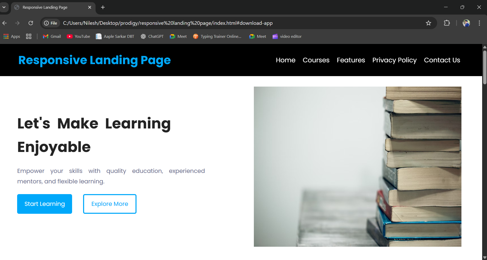
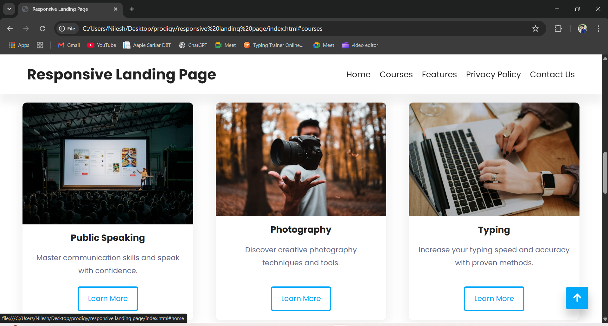
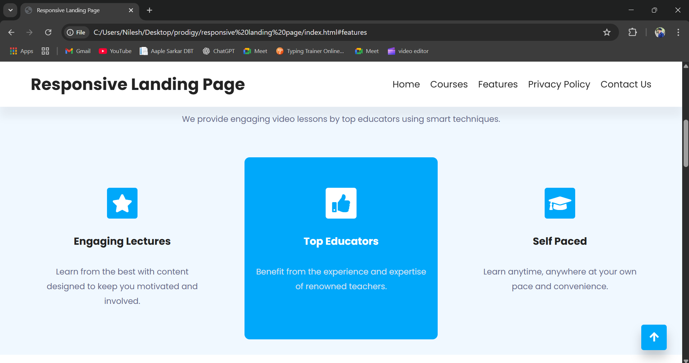
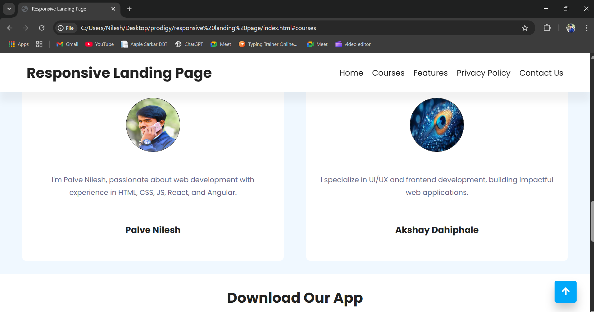

# Responsive Landing Page 🚀

A modern, fully responsive landing page built with **HTML**, **CSS**, and **JavaScript**. This project demonstrates a clean user interface with smooth scrolling, responsive navigation, and mobile-first design principles. Ideal for showcasing educational platforms, SaaS products, or personal branding.

## 🌐 Live Preview

[](https://youtu.be/c-GpcHRXO6Y)

## 📁 Project Structure

```
├── README.md
├── index.html          # Main HTML file
├── style.css           # Stylesheet for layout & responsiveness
├── script.js           # JavaScript for interactivity and scroll behavior
├── nilesh.jpg          # Testimonial image
└── images/             # Screenshots folder
    ├── home-page.png
    ├── features.png
    ├── courses.png
    └── privacy-policy.png
```

## 💡 Features

- ✅ Responsive design for all screen sizes
- ✅ Scroll-to-top button
- ✅ Sticky header on scroll
- ✅ Hero section with CTA buttons
- ✅ Features & Courses showcase
- ✅ Testimonials with images
- ✅ Contact & download section
- ✅ Font Awesome icons & Google Fonts

## 📸 Screenshots

### 🏠 Home Page


### ⭐ Features Section


### 🎓 Courses Section


### 🔐 Privacy Policy Section


## 🛠️ Tech Stack

- **HTML5**
- **CSS3**
- **Vanilla JavaScript**
- [Font Awesome](https://fontawesome.com/)
- [Google Fonts - Poppins](https://fonts.google.com/specimen/Poppins)

## 📬 Contact

**Palve Nilesh**  
📧 Email: [palvenileshp@gmail.com](mailto:palvenileshp@gmail.com)  
📞 Phone: +91 8600453249  
🌐 LinkedIn: [linkedin.com/in/nileshpalve](https://www.linkedin.com/in/nileshpalve/)  
💻 GitHub: [github.com/palve-2003](https://github.com/palve-2003)

---

> Made with ❤️ by Nilesh Palve
